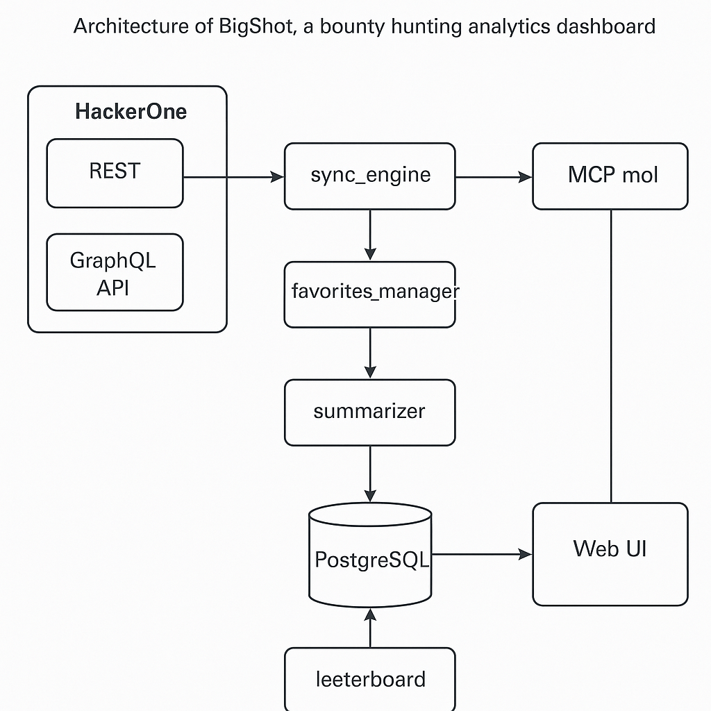

# 🏗️ Architecture
<!-- TODO: remove emoji from header -->

### Design Constraints

- All functionality must run on a private LAN
- PostgreSQL as the core DB
- LLM served via LMStudio (no cloud inference)
- HackerOne data accessed via GraphQL MCP server
- CLI- and UI-friendly components (non-exclusive)

### Data Flow

1. `sync_engine` uses the HackerOne GraphQL MCP server
2. Raw report data is written to Postgres
3. `summarizer` sends reports to LMStudio for summarization
4. Favorite programs are flagged for archival
5. `leeterboard` builds peer rankings per team
6. UI renders summaries, stats, and leaderboards

